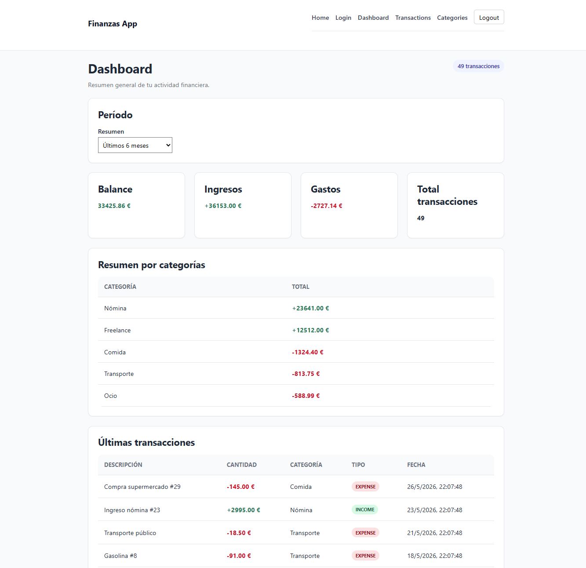
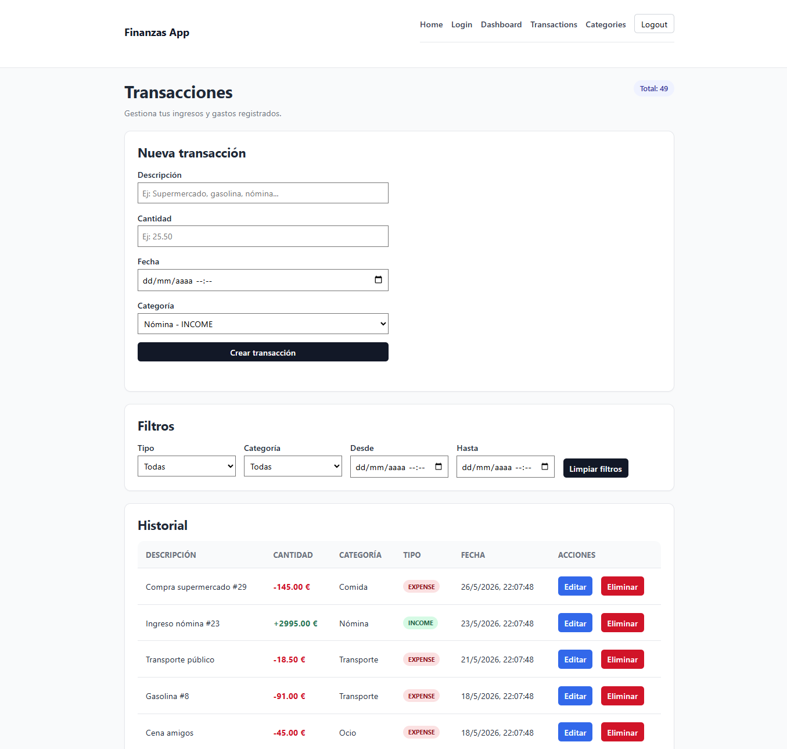
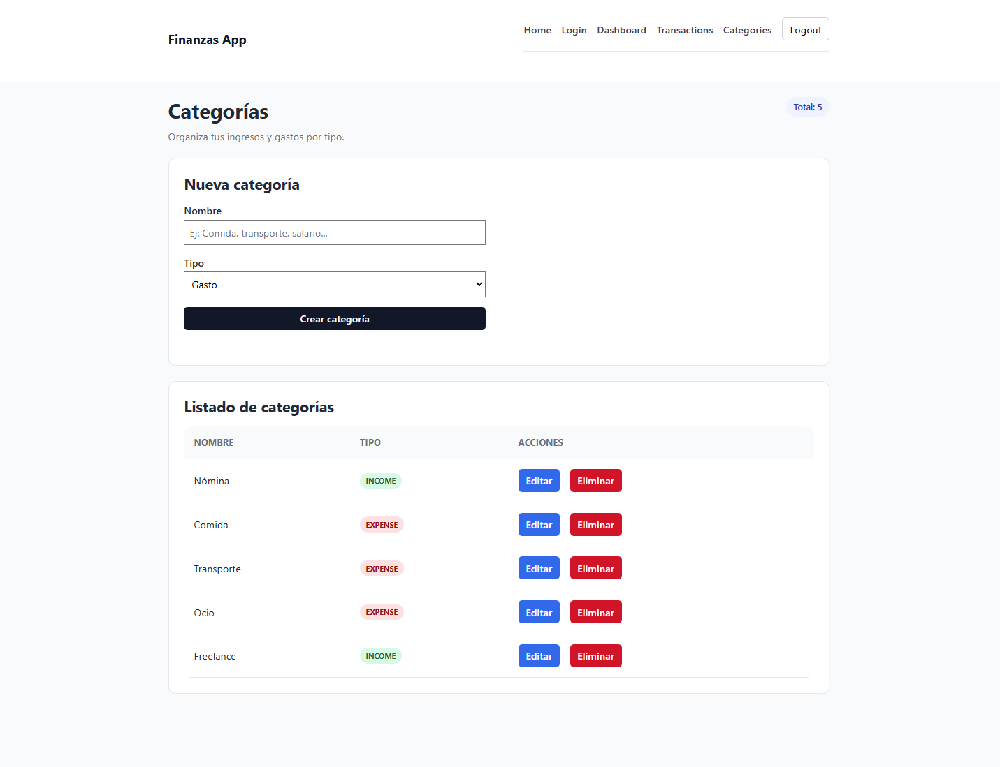
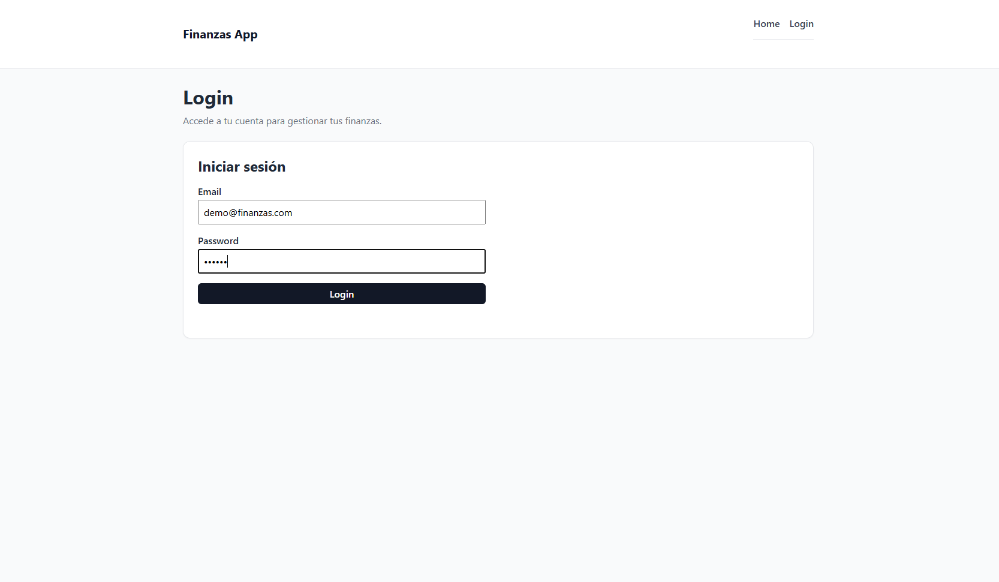
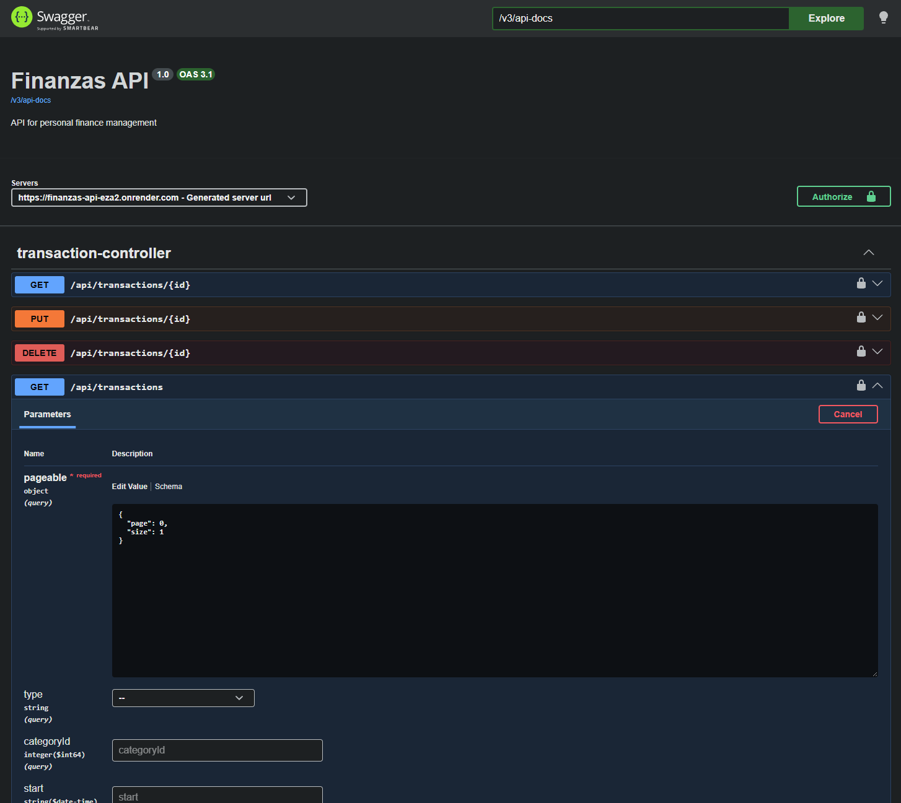

# Gestor de Finanzas

Aplicación Full Stack para la gestión de finanzas personales desarrollada con **Spring Boot, React, PostgreSQL y Docker**.

El objetivo del proyecto es permitir a los usuarios gestionar ingresos, gastos y categorías de forma segura mediante autenticación JWT, proporcionando además herramientas de análisis financiero a través de filtros avanzados y un dashboard interactivo.

---

## Demo Online

### Frontend

https://gestor-de-finanzas-snowy.vercel.app

### API

https://finanzas-api-eza2.onrender.com

### Swagger

https://finanzas-api-eza2.onrender.com/swagger-ui/index.html

---

## Características principales

### Autenticación y Seguridad

* Registro de usuarios
* Inicio de sesión
* Autenticación JWT
* Contraseñas cifradas con BCrypt
* Protección de rutas y endpoints
* Aislamiento de datos por usuario
* Sesiones Stateless

### Gestión de Categorías

* Crear categorías
* Consultar categorías
* Editar categorías
* Eliminar categorías
* Clasificación por tipo:

  * INCOME
  * EXPENSE

### Gestión de Transacciones

* Crear transacciones
* Consultar transacciones
* Editar transacciones
* Eliminar transacciones
* Paginación
* Ordenación por fecha
* Filtros por tipo
* Filtros por categoría
* Filtros por rango de fechas

### Dashboard Financiero

* Balance total
* Total de ingresos
* Total de gastos
* Total de transacciones
* Últimas transacciones registradas
* Resumen por categorías
* Análisis por períodos:

  * Última semana
  * Última quincena
  * Último mes
  * Últimos 3 meses
  * Últimos 6 meses
  * Último año

---

## Tecnologías

### Backend

* Java 21
* Spring Boot 3
* Spring Security
* JWT Authentication
* Spring Data JPA
* Hibernate
* PostgreSQL
* OpenAPI / Swagger

### Frontend

* React
* TypeScript
* React Router
* Axios
* Vite

### DevOps

* Docker
* Docker Compose

---

## Arquitectura

El backend sigue una arquitectura por capas:

* Controller
* Service
* Repository
* DTO
* Mapper
* Security
* Exception Handling

La aplicación utiliza autenticación JWT y control de acceso por usuario para garantizar que cada usuario solo pueda acceder a sus propios recursos.

---

## Estructura del Proyecto

```text
Gestor-de-finanzas
│
├── finanzas-api
│   ├── Controllers
│   ├── Services
│   ├── Repositories
│   ├── DTOs
│   ├── Security
│   ├── Exceptions
│   └── Docker
│
└── finanzas-web
    ├── Pages
    ├── Components
    ├── Services
    ├── Types
    ├── Layouts
    └── API
```

---

## Docker

La aplicación puede ejecutarse completamente mediante Docker Compose.

### Servicios incluidos

* PostgreSQL
* Finanzas API

### Ejecución

```bash
cd finanzas-api

docker compose up --build
```

La API estará disponible en:

```text
http://localhost:8080
```

---

## Variables de Entorno

### Backend

Variables utilizadas:

```env
POSTGRES_DB=
POSTGRES_USER=
POSTGRES_PASSWORD=

JWT_SECRET=
JWT_EXPIRATION_MS=
```

### Frontend

```env
VITE_API_URL=http://localhost:8080/api
```

---

## Documentación API

Swagger UI disponible en:

### Producción

https://finanzas-api-eza2.onrender.com/swagger-ui/index.html

### Local

http://localhost:8080/swagger-ui/index.html

La documentación permite:

* Consultar endpoints
* Probar peticiones
* Autenticarse mediante JWT
* Visualizar modelos y respuestas

---

## Datos de Prueba

Durante el desarrollo se incluye un perfil local con datos de ejemplo:

* Usuario demo
* Categorías predefinidas
* Transacciones de prueba
* Dashboard con información suficiente para validar filtros y paginación

---

## Capturas

### Dashboard



### Transacciones



### Categorías



### Login



### Swagger API



---

## Estado Actual

### Backend

✅ Completado

### Frontend

✅ Completado

### Docker

✅ Completado

### OpenAPI

✅ Completado

### Dashboard

✅ Completado

### Despliegue

✅ Backend desplegado en Render
✅ Frontend desplegado en Vercel

---

## Producción

La aplicación se encuentra desplegada y accesible públicamente:

### Backend

- Render
- PostgreSQL Neon
- Spring Boot
- JWT Authentication

### Frontend

- Vercel
- React
- TypeScript
- Vite

### Base de Datos

- PostgreSQL
- Neon Database

> El primer acceso puede tardar unos segundos debido a las limitaciones del plan gratuito de Render.

## Roadmap

### V1

* [x] Backend Spring Boot
* [x] Seguridad JWT
* [x] PostgreSQL
* [x] Docker
* [x] Swagger / OpenAPI
* [x] Frontend React
* [x] Integración Full Stack
* [x] Dashboard financiero
* [x] Despliegue

### V2

* [ ] Auth Context
* [ ] Navbar dinámica
* [ ] Ocultar login para usuarios autenticados
* [ ] Dashboard personalizado
* [ ] Gráficos financieros
* [ ] Mejoras visuales
* [ ] Tailwind CSS
* [ ] Testing Frontend

---

## Autor

Desarrollado como proyecto de portfolio Full Stack utilizando Java, Spring Boot, React, PostgreSQL y Docker.
